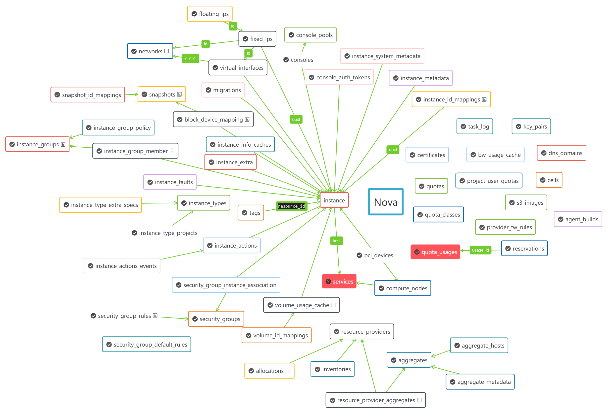
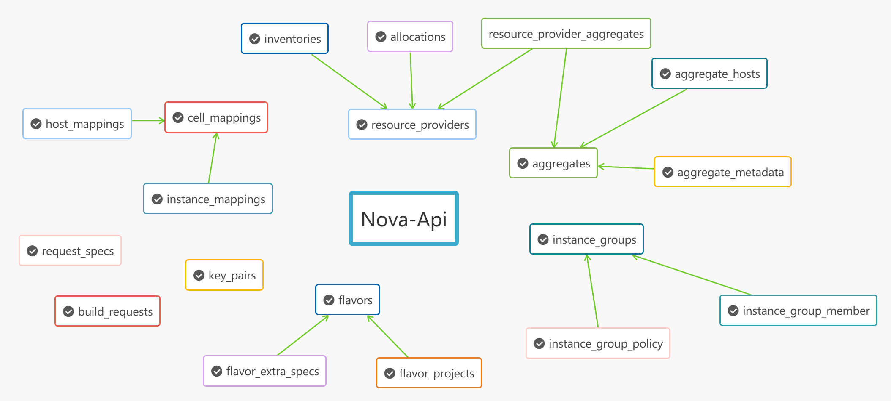
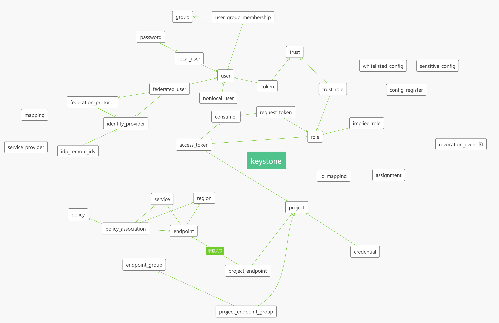
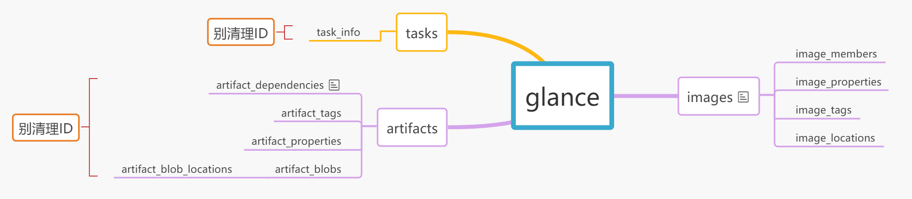
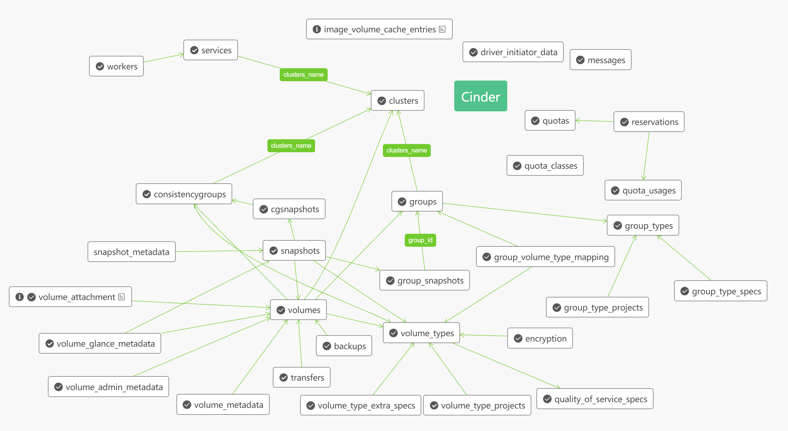

# OpenStack合并方案

将目前多套openstack合并成一个。

适用于N版

## 使用说明

切换root用户。

1. 在控制节点执行`bash service.sh control stop`、计算节点执行`bash service.sh compute stop`停止服务。
2. 进入db目录，修改db.sh文件相关IP、密码后执行`bash db.sh -b`进行数据库备份。
3. 进行nova、cinder数据库预处理，示例见下面各组件的数据预处理部分。
4. 进入merge目录，修改各个py文件中的数据库连接IP、用户名、密码、端口等，然后执行`bash merge.sh`。(这里需要安装环境)

至此数据库合并完成。

----

然后将需要替换的代码(nova、novaclient、glance、glance_store、glanceclient)放到`code`目录下，依次执行：

```sh
cd code

# 计算节点
bash replace.sh compute backup
bash replace.sh compute replace

# 控制节点
bash replace.sh control backup
bash replace.sh control replace
```

然后修改控制节点的nova.conf、glance-api.conf、cinder.conf使其支持多ceph，修改计算节点nova.conf支持多ceph。

对于原集群2的节点还要额外修改nova.conf、neutron.conf中关于控制节点、数据库、网络等IP为集群1的IP。

修改hosts文件，补充各个节点的名称和IP以便支持迁移。

最后控制节点执行`bash service.sh control start`、计算节点执行`bash service.sh compute start`启动服务。

----

如果要恢复成2套集群：

1. 在控制节点执行`bash service.sh control stop`、计算节点执行`bash service.sh compute stop`停止服务。
2. 在原集群1和集群2的控制节点执行`bash replace.sh control recover`
3. 在原集群1和集群2的计算节点执行`bash replace.sh compute recover`
4. 進入`sql`目录进行数据库恢复`bash db.sh -r`(或者让数据库同事帮忙恢复)
5. 在控制节点执行`bash service.sh control start`、计算节点执行`bash service.sh compute start`启动服务。

## 注意

必须保证2套集群nova配置中使用同样的ceph用户(即keyring要保持一致)，并且`rbd_secret_uuid`一样，且在libvirt中注册，注册后执行`systemctl restart libvirtd`重启libvirt服务。

无则需要在2套ceph中使用同样的keyring创建同一个用户并赋予同样的权限。

1. 注意核查`/etc/libvirt/secrets`目录下是否有对应的uuid，无则创建并注册(`nova.conf`中的`rbd_secret_uuid`)，。
1. 注意核查合并后各个节点的`/etc/ceph/`目录下是否有对应的ceph用户、以及相应的池读写权限。
1. 添加对应的backend类型并绑定(存疑)。


## 数据库合并

注意：**主键冲突、外键约束、唯一值约束**。

### Nova

__最后合并这个。__

数据预处理：
```sql
ALTER TABLE `nova`.`instances`
  ADD COLUMN `dest_rbd_pool` VARCHAR(255) NULL AFTER `architecture`;

ALTER TABLE `nova`.`compute_nodes`
  ADD COLUMN `pool_info` TEXT NULL AFTER `local_gb_used`;

ALTER TABLE `nova`.`compute_nodes`
  ADD COLUMN `default_ceph` VARCHAR(64) NULL AFTER `local_gb_used`;

update instances set dest_rbd_pool='xxx' --根据情况替换这里是ceph1或者ceph2
update `nova`.`compute_nodes` set default_ceph='ceph1'
```

58个表:



重点核实表：

* block_device_mapping
* compute_nodes
* instance_actions
* instance_actions_events
* instance_extra
* instance_faults
* instance_id_mappings
* instance_info_caches
* instance_system_metadata
* instances
* migrations
* quota_usages
* reservations
* s3_images
* security_groups-这个有唯一约束会报错。涉及project_id，理论上这个表project_id应该一样的，但实际上并不是。暂时略过等待Project——id统一处理。（理论上这个表可以不用合并）
* services-不用合并，修改计算节点修改配置重启后会自动添加进来。
* virtual_interfaces

### Nova-Api

先导入nova库在导入这个。

20个表:

这个库两个集群是否已经有同样的数据了？



重点核实表：

* flavor_extra_specs
* flavors-使用自增id为主键，执行合并前确保不同集群中相同name的有相同flavorid，否则被忽略。
* key_pairs
* request_specs

### Keystone

其他表中依赖的`project_id`字段在这个表里，合并前先核实各个集群中的数据是否是一样的。

有云管处理保证里面的project_id统一且唯一，所以这个库不用合并。

37个表：



1. `doamin_id`是？貌似已经被废弃掉了？代码中有`keystone\resource\V8_backends\sql.py`，但数据库中并没这个表。

重点核实表：

1. project-存疑有些数据相同有些又不同，数量也不一致。另外很多其他的库表依赖这个project。（以云管中project为准，理论上应该不用合并）
2. endpoint-记录了各个组件的地址，不用合并。
3. region-重复数据，不用合并。
4. revocation_event-不用合并
5. role-不用合并
6. assignment-不用合并，role_id(role表中的ID)，actor_id(user表中的ID) target_id(project项目的ID)，这个表记录了用户、角色、项目之间的关系。调用接口删除project时会把这张表相关的数据删掉。
7. service-不用合并
8. user-不用合并
9. password-不用合并
10. local_user-不用合并。

### Glance

20个表:



nova的block_device_mapping的image_id在`image`这里。

__注意:真正为了多ceph合并集群时请先修改image_locations表中的meta_data字段！！！__

重点核实表：

1. image_locations-合并前按需修改image_locations表中的meta_data字段
1. image_properties
1. images
1. metadef_resource_types-不要合并。

### Cinder

32个表:



1. `quotas`表中的`allocated`字段是不是`Reservation`表的`allocated_id`字段？
2. `group_type_projects`表中`group_type_id`定义是个Interger，但数据库以及`group_type.id`代码定义都是字符串，代码BUG还是？

nova中的block_device_mapping、volume_usage_cache、snapshots中的volume_id可能在这里。

重点核实表：

1. quality_of_service_specs-自关联？
2. quota_classes-不用合并
3. quota_usages
4. reservations
5. services
6. snapshots
7. volume_admin_metadata
8. volume_attachment
9. volume_type_extra_specs
10. volume_types
11. volumes

数据预处理：

**cinder库有特殊的地方，!合并前!需要根据实际情况去修改`volumes`表的`host`字段和`volume_type_extra_specs`的`value`，否则会出现存量数据无法卸载、旧磁盘类型无法创建磁盘等情况**

```sql
-- 示例，根据情况修改
select distinct `host` from volumes

Update `volumes`
SET `host` = replace (`host`,'旧的磁盘类型，即@分隔符之后的部分','新磁盘类型')

-- Update `volumes`
-- SET `host` = replace (`host`,'ceph2#ceph2','ceph2_sas#ceph2_sas')

update `volume_type_extra_specs` 
set `value` = '新磁盘类型'
where `value` = '旧磁盘类型'

-- 以下语句仅在集群二执行!!
Update `volumes`
SET `host` = replace (`host`,'集群2的hostname，即@分隔符之前的部分','集群1的hostname')
```

### Neutron

163个表：

继承了`model_base.BASEV2`的类没显式定义`__tablename__`，表名就是类名小写+s，继承了`model_base.HasId`的类ID为uuid。这两个基类不在`neutron`中而是分离在`neutron-lib`库。

1. 有些表的主键为int型但是并不自增，需要核实是否会冲突。比如`ml2_nexus_vxlan_allocations`的`vxlan_vni`、`ml2_geneve_allocations`的`geneve_vni`。目前是把ID清理了。
2. 有些表使用联合主键但是包含自增ID的列，这个表需要核实。比如`cisco_ml2_nexus_nve`、`nsxv_edge_vnic_bindings`、`ha_router_vrid_allocations`。
3. 核实`subnets`中网段数据。
4. `ipallocations`中记录了具体的IP地址。
5. `ports`中的`device_id`记录了绑定了哪个主机(UUID)或设备。

重点核实表:

1. agents
2. allowedaddresspairs
3. default_security_group
4. dnsnameservers
5. ipallocationpools
6. ipallocations -这个表记录哪些IP被分配了，联合主键
7. ipamallocationpools
8. ipamallocations
9.  ipamsubnets
10. ml2_flat_allocations
11. ml2_port_binding_levels
12. ml2_port_bindings
13. ml2_vlan_allocations-`physical_network`都是physnet2么？
14. ml2_vxlan_allocations-数据完全一样。
15. networkdhcpagentbindings
16. networkrbacs
17. networks
18. networksecuritybindings
19. networksegments
20. ports
21. portsecuritybindings
22. provisioningblocks
23. quotausages-注意联合主键
24. securitygroupportbindings-这个表决定了虚拟机网卡和安全组之间的绑定
25. securitygrouprules
26. securitygroups
27. segmenthostmappings
28. standardattributes
29. subnets

合并后默认安全策略不会生效（症状就是无网络连接），需要添加一条默认规则后重启nova-compute，但出现了一次重启后子网被删除的情况。具体还需进一步观察。


## 常用命令

xml文件位置 /etc/libvirt/qemu(kvm)

```sh
nova service-list
nova list --all --fields=name,host,instance_name,status
nova live-migration  uuid hostname
nova migrate uuid
nova resize uuid flavor_id
nova resize-confirm uuid 冷迁移后也要执行

定义：virsh define xxx.xml xxx为xml文件所在的路径及文件名称，在当前目录下则不写路径
启动：virsh start xyz xyz为虚拟机xml配置文件中虚拟机的名字<name>rhel6.2_2</name>
停止：virsh shutdown xyz 此方法为正常关机方法，需要一段才能关机
下电：virsh destroy xyz 此方法为暴力下电，虚拟机立即关闭
删除：virsh undefinexxx 关闭了的虚拟机，只是不在运行状态而已，通过virsh undefine xxx就能从virsh列表里面（virsh list查看当前系统中的虚拟机列表，详见第2.4节）将其删除，undefine命令不会删除镜像文件和xml文件。运行状态的虚拟机是不能删除的。

临时起虚拟机：virsh create xxx.xml 此方法为方便开发调试等临时需求，不会持久化，虚拟机关机后就消失了，不推荐生产系统使用。
查看VNC端口：virsh vncdisplay xx 查看VNC端口，其中xx可通过virsh list查看

uuidgen
vi  27d3170d-521a-4192-957a-76eef309e869.xml
virsh secret-define --file 27d3170d-521a-4192-957a-76eef309e869.xml
virsh secret-set-value --secret 27d3170d-521a-4192-957a-76eef309e869  --base64 AQBb+RcOlQCERAAwPnTVvwwGXPD9pIRMQbHGw==

rbd ls -p poolname
rbd -c /etc/ceph/ceph.conf --user compute01  -p compute01 -k /etc/ceph/ceph.client.compute01.keyring ls -l
rbd info {pool_name}/{image_name}
rbd export -p poolname --image imagename ./  filename
rbd inport -p poolname filename imagename

rbd snap rm
rbd children
```

## 其他

如果系统环境不支持脚本运行（比如无法安装某些依赖、版本过旧等），可以将env环境打包上传，然后再`utils.py`中添加；

```py
import sys
sys.path.insert(1,'env/lib64/python2.7/site-packages/')
sys.path.insert(1,'env/lib/python2.7/site-packages/')
```